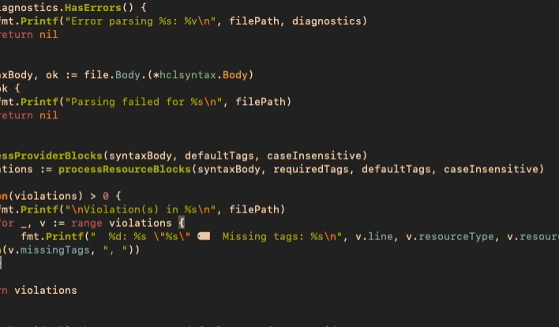

# notes.nvim




## Installation

packer:
```lua
use('jakebark/notes.nvim')
```
vim plug:
```lua
use('jakebark/notes.nvim')
```
lazy:
```lua
{
  'jakebark/notes.nvim',
  config = function() require("notes") end,
}
```
manual:
```bash
git clone https://github.com/jakebark/notes.nvim.git ~/.local/share/nvim/site/pack/notes/start/notes.nvim
```

## Configuration

```lua
require("notes").setup({
  height = 20,                   -- window height
  width = 80,                    -- window width
  relative_numbers = true,       -- false for absolute
  notes_file_path = "~/notes.md" -- path to your notes file
})
```

